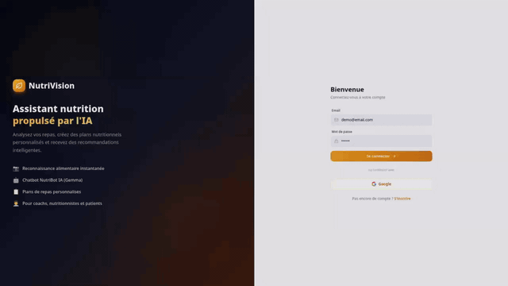

# NutriVision - AI Nutrition Assistant

[](https://www.kaggle.com/competitions)

[View on GitHub](https://github.com/BLD933/NutriVision)

NutriVision is an AI-powered nutrition assistant that analyzes food photos, provides personalized recommendations, and helps manage meal planning for health conditions.

## Demo



*[Télécharger la vidéo complète](demo/nutrivision-demo.mp4)*

## Project Structure

```
nutrivision/
├── backend/                  # Flask API (port 5000)
│   ├── agents/               # AI agents (Gemma, Vision, Supervisor, etc.)
│   ├── models/               # YOLO food detection models
│   ├── nutrition/            # Nutrition logic & recommendations
│   ├── rag/                  # ChromaDB vector store
│   ├── routes/               # API endpoints (analyse, chat, clients, recipes, meal-plan)
│   ├── app.py                # Flask entry point
│   ├── config.py             # Firebase initialization
│   └── requirements.txt
├── frontend/                 # React + Vite app (port 5173)
│   ├── src/
│   │   ├── components/       # Reusable UI components
│   │   ├── pages/            # Page views (Analyse, ChatBot, Clients, Recettes, MealPlan, Dashboard)
│   │   ├── lib/              # API client, auth helpers
│   │   └── ...
│   ├── public/
│   ├── package.json
│   └── vite.config.js        # Proxies /api → backend
├── scripts/                  # Utility scripts
│   └── kaggle_mfood_yolo.py  # Download MFOOD YOLO model
├── project_description/      # Test images and docs
├── docs/                     # Additional documentation
├── .env.example              # Environment variable template
├── LICENSE                   # MIT License
└── README.md
```

## Features

- **Food Detection**: MFOOD YOLO model detects 70 Moroccan food dishes
- **AI Analysis**: Gemma 4B provides detailed nutritional analysis
- **Personalized Recommendations**: Tailored advice based on health conditions
- **Meal Planning**: Generate weekly meal plans with dietary restrictions
- **Recipe Generation**: AI-powered recipe creation from ingredients

## Tech Stack

- **Frontend**: React + Vite, Tailwind CSS
- **Backend**: Flask (Python), Firebase Auth
- **AI Models**: 
  - MFOOD YOLOv8 (food detection)
  - Gemma 4B (nutritional analysis)
- **Database**: Firestore (user profiles, analysis history)

## Quick Start

```bash
# Clone
git clone https://github.com/your-org/nutrivision.git
cd nutrivision

# Backend
cd backend
source venv/bin/activate
pip install -r requirements.txt
python app.py  # Runs on port 5000

# Frontend
cd ../frontend
npm install
npm run dev  # Runs on port 5173
```

## API Endpoints

| Endpoint | Method | Description |
|----------|--------|-------------|
| `/api/analyse` | POST | Analyze food photo (multipart form with `image` field) |
| `/api/chat/stream` | POST | Stream chat with NutriBot (SSE) |
| `/api/clients/plan` | POST | Generate personalized health plan |
| `/api/recipes/generate` | POST | Generate recipe from ingredients |
| `/api/meal-plan/generate/stream` | POST | Generate weekly meal plan (SSE) |

## Environment Variables

### Backend (`backend/.env`)
```
FIREBASE_SERVICE_ACCOUNT_KEY=<json-key>
GEMINI_API_KEY=<optional-for-cloud-gemma>
```

### Frontend (`frontend/.env`)
```
VITE_FIREBASE_API_KEY=<key>
VITE_FIREBASE_AUTH_DOMAIN=<domain>
VITE_FIREBASE_PROJECT_ID=<id>
VITE_FIREBASE_STORAGE_BUCKET=<bucket>
VITE_FIREBASE_MESSAGING_SENDER_ID=<id>
VITE_FIREBASE_APP_ID=<id>
```

## Development

```bash
# Run tests
cd backend
pytest tests/

# Lint
cd frontend
npm run lint
```

## License

MIT License - see [LICENSE](LICENSE) file for details.

## Acknowledgments

- MFOOD dataset for food detection
- Gemma model by Google
- Firebase for authentication